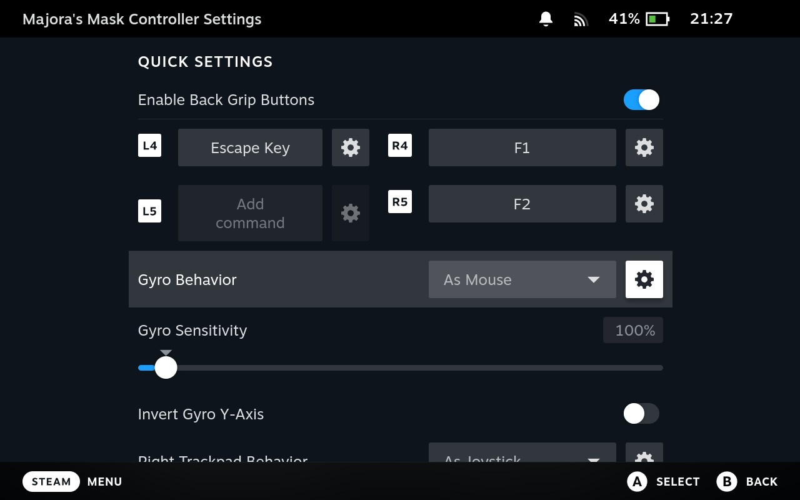

# Zelda 64: Recompiled
Zelda 64: Recompiled is a project that uses [N64: Recompiled](https://github.com/Mr-Wiseguy/N64Recomp) to **statically recompile** Majora's Mask (and soon Ocarina of Time) into a native port with many new features and enhancements. This project uses [RT64](https://github.com/rt64/rt64) as the rendering engine to provide some of these enhancements.

### [Check out the latest release here](https://github.com/Mr-Wiseguy/Zelda64Recomp/releases/latest).

### **This repository and its releases do not contain game assets. The original game is required to build or run this project.**

<a href="https://runblaze.dev">
 <picture>
   <source media="(prefers-color-scheme: dark)" srcset="https://www.runblaze.dev/logo_dark.png">
   
 </picture>
</a>

 

_Thank you [Blaze](https://runblaze.dev) for supporting this project by providing Linux ARM64 and Apple Silicon macOS Github Action Runners!_

## Table of Contents
* [System Requirements](#system-requirements)
* [Features](#features)
  * [Plug and Play](#plug-and-play)
  * [Fully Intact N64 Effects](#fully-intact-n64-effects)
  * [Easy-to-Use Menus](#easy-to-use-menus)
  * [High Framerate Support](#high-framerate-support)
  * [Widescreen and Ultrawide Support](#widescreen-and-ultrawide-support)
  * [Dual Analog Camera](#dual-analog-camera)
  * [Gyro Aim](#gyro-aim)
  * [Additional Control Options](#additional-control-options)
  * [Autosaving](#autosaving)
  * [Low Input Lag](#low-input-lag)
  * [Instant Load Times](#instant-load-times)
  * [Linux and Steam Deck Support](#linux-and-steam-deck-support)
* [Planned Features](#planned-features)
* [FAQ](#faq)
* [Known Issues](#known-issues)
* [Building](#building)
* [Libraries Used and Projects Referenced](#libraries-used-and-projects-referenced)

## System Requirements
A GPU supporting Direct3D 12.0 (Shader Model 6) or Vulkan 1.2 is required to run this project. The oldest GPUs that should be supported for each vendor are:
* GeForce GT 630
* Radeon HD 7750 (the one from 2012, not to be confused with the RX 7000 series) and newer
* Intel HD 510 (Skylake)

A CPU supporting the AVX instruction set is also required (Intel Core 2000 series or AMD Bulldozer and newer).

If you have issues with crashes on startup, make sure your graphics drivers are fully up to date. 

## Features

#### Plug and Play
Simply provide your copy of the North American version of the game in the main menu and start playing! This project will automatically load assets from the provided copy, so there is no need to go through a separate extraction step or build the game yourself. Other versions of the game may be supported in the future.

#### Fully Intact N64 Effects
A lot of care was put into RT64 to make sure all graphical effects were rendered exactly as they did originally on the N64. No workarounds or "hacks" were made to replicate these effects, with the only modifications to them being made for enhancement purposes such as widescreen support. This includes framebuffer effects like the grayscale cutscenes and the Deku bubble projectile, depth effects like the lens of truth, decals such as shadows or impact textures, accurate lighting, shading effects like the fire arrows and bomb explosions, and various textures that are often rendered incorrectly.

#### Easy-to-Use Menus
Gameplay settings, graphics settings, input mappings, and audio settings can all be configured with the in-game config menu. The menus can all be used with mouse, controller, or keyboard for maximum convenience.

#### High Framerate Support
Play at any framerate you want thanks to functionality provided by RT64! Game objects and terrain, texture scrolling, screen effects, and most HUD elements are all rendered at high framerates. By default, this project is configured to run at your monitor's refresh rate. You can also play at the original framerate of the game if you prefer. **Changing framerate has no effect on gameplay.**

**Note**: External framerate limiters (such as the NVIDIA Control Panel) are known to potentially cause problems, so if you notice any stuttering then turn them off and use the manual framerate slider in the in-game graphics menu instead.

#### Widescreen and Ultrawide Support
Any aspect ratio is supported, with most effects modded to work correctly in widescreen. The HUD can also be positioned at 16:9 when using ultrawide aspect ratios if preferred.

**Note**: Some animation quirks can be seen at the edges of the screen in certain cutscenes when using very wide aspect ratios.

#### Dual Analog Camera
Play with a dual analog control layout like later entries in the series! When this option is enabled, the right stick will control the camera. You can still have the C-Buttons mapped to the right stick if you so wish, so long as you also map them to other buttons on the controller. The right stick C-button inputs will be "silenced", except when you take out the ocarina, so you can still play the ocarina with the right stick.

#### Gyro Aim
When playing with a supported controller, first-person items such as the bow can be aimed with your controller's gyro sensor. This includes (but is not limited to) controllers such as the Dualshock 4, Dualsense, Switch Pro, and most third party Switch controllers (such as the 8BitDo Pro 2 in Switch mode).

**Note**: Gamepad mappers such as BetterJoy or DS4Windows may intercept gyro data and prevent the game from receiving it. Most controllers are natively supported, so turning gamepad mappers off is recommended if you want to use gyro.

#### Additional Control Options
Customize your experience by setting your stick deadzone to your liking, as well as adjusting the X and Y axis inversion for both aiming and the optional dual analog camera.

#### Autosaving
Never worry about losing progress if your power goes out thanks to autosaving! The autosave system is designed to respect Majora's Mask's original save system and maintain the intention of owl saves by triggering automatically and replacing the previous autosave or owl save. However, if you'd still rather play with the untouched save system, simply turn off autosaving in the ingame menu.

#### Low Input Lag
This project has been optimized to have as little input lag as possible, making the game feel more responsive than ever!

#### Instant Load Times
Saving and loading files, going from place to place, and pausing all happen in the blink of an eye thanks to the game running natively on modern hardware.

#### Linux and Steam Deck Support
A Linux binary is available for playing on most up-to-date distros, including on the Steam Deck.

To play on Steam Deck, extract the Linux build onto your deck. Then, in desktop mode, right click the Zelda64Recompiled executable file and select "Add to Steam". From there, you can return to Gaming mode and configure the controls as needed. See the [Steam Deck gyro aim FAQ section](#how-do-i-set-up-gyro-aiming-on-steam-deck) for more detailed instructions.

## Planned Features
* Ocarina of Time support
* Mod support and Randomizer
* Texture Packs
* Model Replacements
* Ray Tracing (via RT64)
* Multi-language support with support for loading custom translations

## FAQ

#### What is static recompilation?
Static recompilation is the process of automatically translating an application from one platform to another. For more details, check out the full description of how this project's recompilation works here: [N64: Recompiled](https://github.com/Mr-Wiseguy/N64Recomp).

#### How is this related to the decompilation project?
Unlike N64 ports in the past, this project is not based on the source code provided by a decompilation of the game. This is because static recompilation bypasses the need for decompiled source code when making a port, allowing ports to be made **without source code**. However, the reverse engineering work done by the decompilation team was invaluable for providing some of the enhancements featured in this project. For this reason, the project uses headers and some functions from the decompilation project in order to make modifications to the game. Many thanks to the decompilation team for all of the hard work they've done.

#### How do I set up gyro aiming on Steam Deck?
This project provides mouse aiming as a way to allow using gyro on Steam Deck, as the Steam Deck's gyro sensors cannot be read directly. First, launch the game in Gaming Mode, press the Steam button and go to "Controller Settings". Choose "Controller Settings" again in the menu that follows, and then set "Gyro Behavior" to "As Mouse".

You'll probably also want to change the default behavior so that you don't need to be touching the right stick to allow gyro input. To do so, click on the Gear icon to the right of "Gyro Behavior" and ensure that "Gyro Activation Buttons" is set to "None Selected (Gyro Always On)." If this isn't the case, then select that option and then press "Select None" in the following menu.

#### Where is the savefile stored?
- Windows: `%LOCALAPPDATA%\Zelda64Recompiled\saves`
- Linux: `~/.config/Zelda64Recompiled/saves`

#### How do I choose a different ROM?
**You don't.** This project is **only** a port of Majora's Mask (and Ocarina of Time in the future), and it will only accept one specific ROM: the US version of the N64 release of Majora's Mask. ROMs in formats other than .z64 will be automatically converted, as long as it is the correct ROM. **It is not an emulator and it cannot run any arbitrary ROM.** 

If you want to play a modded ROM or in another language, note that support for modding and other languages will be added to the project itself in the future and will not rely on you supplying a different ROM. 

## Known Issues
* Intel GPUs on Linux may not currently work. If you have experience with Vulkan development on Linux, help here would be greatly appreciated!
* The prebuilt Linux binary may not work correctly on some distributions of Linux. If you encounter such an issue, building the project locally yourself is recommended. A Flatpak or AppImage may be provided in the future to solve this issue. Adding the Linux version to Steam and setting "Steam Linux Runtime" as the compatibility tool or launching it via Gamescope may work around the issue. Alternatively, running the Windows version with Proton is known to work well and may also work around this issue.
* Overlays such as MSI Afterburner and other software such as Wallpaper Engine can cause performance issues with this project that prevent the game from rendering correctly. Disabling such software is recommended.

## Building
Building is not required to play this project, as prebuilt binaries (which do not contain game assets) can be found in the [Releases](https://github.com/Mr-Wiseguy/Zelda64Recomp/releases) section. Instructions on how to build this project can be found in the [BUILDING.md](BUILDING.md) file.

## Libraries Used and Projects Referenced
* [RT64](https://github.com/rt64/rt64) for the project's rendering engine
* [RmlUi](https://github.com/mikke89/RmlUi) for building the menus and launcher
* [lunasvg](https://github.com/sammycage/lunasvg) for SVG rendering, used by RmlUi
* [FreeType](https://freetype.org/) for font rendering, used by RmlUi  
* [moodycamel::ConcurrentQueue](https://github.com/cameron314/concurrentqueue) for semaphores and fast, lock-free MPMC queues
* [Gamepad Motion Helpers](https://github.com/JibbSmart/GamepadMotionHelpers) for sensor fusion and calibration algorithms to implement gyro aiming
* [Majora's Mask Decompilation](https://github.com/zeldaret/mm) for headers and some function definitions, used for making patches or some enhancements
* [Ares emulator](https://github.com/ares-emulator/ares) for RSP vector instruction reference implementations, used in RSP recompilation

Special thanks to [thecozies](https://github.com/thecozies) for designing and helping implement the launcher and config menus!
